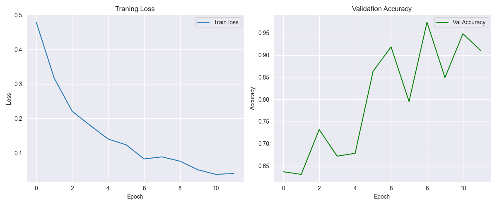
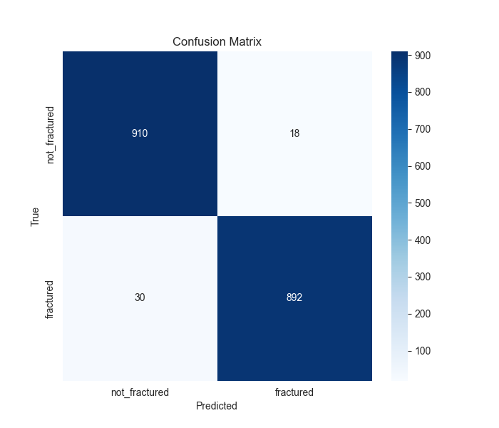

# Bone Fracture Detection with PyTorch & SynFlow Pruning


This repository contains a complete, end-to-end deep learning pipeline to classify bone X-ray images as "fractured" or "not_fractured."

The project demonstrates a full workflow from data analysis to model training and evaluation, with a key feature being the use of **SynFlow (Synaptic Flow)**, a "pruning at initialization" algorithm. The model is pruned to **95% sparsity** *before* training, demonstrating a "Lottery Ticket" style hypothesis.

## Project Workflow

The main script (`train_fracture_model.py` or notebook) performs the following steps:

1.  **Data Loading:** Scans the dataset directory and loads all image paths and labels into a pandas DataFrame.
2.  **Exploratory Data Analysis (EDA):**
    * Prints a summary of the dataset.
    * Generates a bar chart and pie chart to visualize the class distribution (fractured vs. not_fractured).
    * Displays a grid of sample images from each class for a sanity check.
3.  **Data Preprocessing:**
    * Splits the data into training (80%) and validation (20%) sets using a stratified split to maintain class balance.
    * Creates a custom PyTorch `Dataset` class (`FractureDataset`).
    * Defines `torchvision` transforms to resize all images to 224x224 and normalize them with ImageNet statistics.
4.  **Model Initialization:**
    * Loads a pre-trained **ResNet-18** model (`weights='DEFAULT'`).
    * Replaces the final fully-connected layer to output 2 classes for our binary task.
5.  **Model Pruning (SynFlow):**
    * Applies the `synflow_pruning` algorithm to the initialized model.
    * This algorithm identifies and removes 95% of the model's weights *before* training, creating a highly sparse network. The remaining 5% of weights are trained.
6.  **Training:**
    * Trains the sparse model using `CrossEntropyLoss` and the `Adam` optimizer.
    * Includes a full validation loop at the end of each epoch.
    * Implements **Early Stopping** (with a patience of 5 epochs) to save the best-performing model and prevent overfitting.
7.  **Evaluation:**
    * Loads the weights from the best model (`best_fracture_model.pth`).
    * Generates and saves a `curves.png` plot showing training loss vs. validation accuracy.
    * Generates and saves a `confusion_matrix.png` heatmap.
    * Prints a detailed `classification_report` (Precision, Recall, F1-score) to the console.
    * Prints the final parameter count, showing the drastic reduction in model size.

## Dataset

This project is designed to work with the **Bone Fracture Detection in X-rays** dataset, which can be found on Kaggle.

The script expects the data to be in the following folder structure:

```
<BASE_PATH>/
├── fractured/
│   ├── image_1.jpg
│   ├── image_2.jpg
│   └── ...
└── not_fractured/
    ├── image_100.jpg
    ├── image_101.jpg
    └── ...
```

## Installation

1.  **Clone the repository:**
    ```bash
    git clone [https://github.com/your-username/bone_fracture_detection.git](https://github.com/your-username/bone_fracture_detection.git)
    cd bone_fracture_detection
    ```

2.  **Create a virtual environment (recommended):**
    ```bash
    python -m venv venv
    source venv/bin/activate  # On Windows: venv\Scripts\activate
    ```

3.  **Install the required packages:**
    Create a `requirements.txt` file with the following content:

    ```text
    numpy
    pandas
    matplotlib
    seaborn
    opencv-python-headless
    torch
    torchvision
    scikit-learn
    Pillow
    tqdm
    ipywidgets
    ```

    Then, install them:
    ```bash
    pip install -r requirements.txt
    ```

## Usage

1.  **Download the dataset** from Kaggle and place it in your project directory.

2.  **Update the `BASE_PATH` variable** in the script (`train_fracture_model.py` or the first code cell in the `.ipynb` notebook) to point to your `train` folder.

    ```python
    # !!! UPDATE THIS PATH !!!
    BASE_PATH = "D:\\path\\to\\your\\dataset\\train"
    ```

3.  **Run the script:**

    If using the Python script:
    ```bash
    python train_fracture_model.py
    ```

    If using the Jupyter Notebook:
    ```bash
    jupyter notebook train_fracture_model.ipynb
    ```
    Then, run all cells from top to bottom.

## Expected Results

The script will run the full pipeline and produce the following outputs:

### 1. Terminal Output

You will see the training progress, followed by a final evaluation report:

```
...
Epoch 10 | Train Loss: 0.2134 | Val Loss: 0.1876 | Val Acc: 0.9312
New best model saved with accuracy: 0.9312
...
--- Training Complete ---

--- Generating Final Evaluation ---

=== Classification Report ===
               precision    recall  f1-score   support
not_fractured       0.92      0.94      0.93       876
    fractured       0.94      0.92      0.93       915
     accuracy                           0.93      1791
    macro avg       0.93      0.93      0.93      1791
 weighted avg       0.93      0.93      0.93      1791

Final Best Val Accuracy: 0.9312
Total remaining parameters: 585,026
Model is 5.0% of the original size.

Final model saved to fracture_detector_final.pth
```

### 2. Saved Files

* `best_fracture_model.pth`: The model state dictionary with the highest validation accuracy.
* `fracture_detector_final.pth`: The final model state dictionary (identical to the best model if early stopping was used).
* `curves.png`: A plot of training/validation loss and validation accuracy.

    

* `confusion_matrix.png`: A heatmap showing the model's predictions vs. the true labels.

    

## License

This project is licensed under the Apache License. See the `LICENSE` file for details.